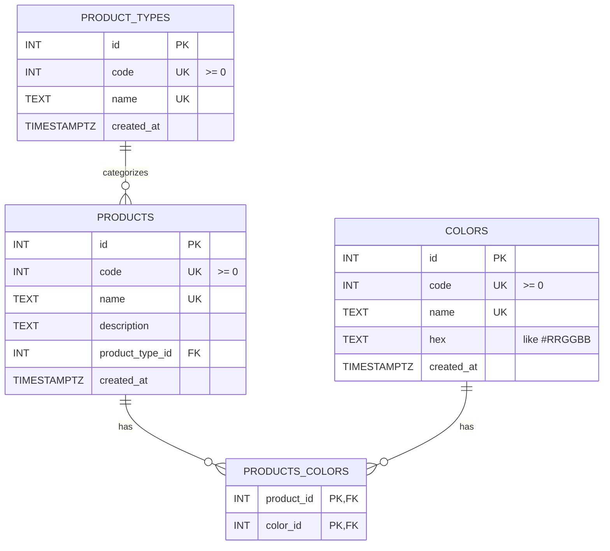

# Product Management System

A simple **Product Management System** with a **Vue + Vuetify** frontend and a **Go + Gin** backend. It lets you create products and list them with their types and colors.

---

## Contents

- [Overview](#overview)
- [Tech Stack](#tech-stack)
- [Quick Start](#quick-start)
- [Configuration](#configuration)
- [Running Locally (no Docker)](#running-locally-no-docker)
- [Docker](#docker)
- [Project Structure](#project-structure)
- [Entity Relationship Diagram](#entity-relationship-diagram)
- [Table Definitions](#table-definitions)
- [Scripts](#scripts)
- [API](#api)
    - [Products](#products)
    - [Product Types](#product-types)
    - [Colors](#colors)
    - [Health](#health)
    - [Error Format](#error-format)

---

## Overview

The system lets you:

- Create a product with **code**, **name**, **type**, and **one or more colors** (description is optional).
- View a paginated list of products with their **type** and **colors**.
- Run everything with **Docker Compose** or run **frontend** and **backend** separately.

**SKU concept:** In this demo, you can think of the SKU as a dotted string combining business codes:  
`<product_type.code>.<product.code>.<color.code>` → e.g., `304.101.10`.

If you are here for the task description, see **[`task.md`](task.md)**.

---

## Tech Stack

- **Frontend:** Vue 3, Vite, Vuetify
- **Backend:** Go (Gin)
- **Database:** PostgreSQL
- **Container:** Docker & Docker Compose

---

## Quick Start

1) **Clone the repo**
```bash
git clone https://github.com/AmirAziziDev/product-management-system.git
cd product-management-system
```

2) **Create environment file**
```bash
cp .env.example .env
```

3) **Start with Docker (recommended)**
```bash
docker compose up --build
```

Services (default):
- Frontend: `http://localhost:3000`
- Backend API: `http://localhost:8080`
- PostgreSQL: `localhost:5432`

> If you prefer running without Docker, see the next sections.

---

## Configuration

Create a `.env` file in the project root. Minimum variables:

```env
POSTGRES_DB=product_management
POSTGRES_USER=postgres
POSTGRES_PASSWORD=password

# Optional overrides
BACKEND_PORT=8080
FRONTEND_PORT=3000
DB_HOST=localhost
DB_PORT=5432
```

> The Docker Compose file will read from `.env`.  
> When running locally without Docker, make sure PostgreSQL is running and these values match your setup.

---

## Running Locally (no Docker)

### 1) Database
- Install PostgreSQL.
- Create database `product_management` (or use your own name and update `.env`).

### 2) Backend
```bash
cd backend
go mod tidy
go run main.go
```
Default backend URL: `http://localhost:8080`

### 3) Frontend
```bash
cd frontend
npm install
npm run dev
```
Default frontend URL: `http://localhost:3000`

---

## Docker

1) Make sure you have **Docker** and **Docker Compose** installed.
2) From the project root:
```bash
docker compose up --build
```
3) Open:
- Frontend: `http://localhost:3000`
- Backend:  `http://localhost:8080`

To stop:
```bash
docker compose down
```

---

## Project Structure

```
product-management-system/
├─ backend/
│  ├─ handlers/            # HTTP handlers (Gin)
│  ├─ middleware/          # Validation, CORS, logging, etc.
│  ├─ models/              # Domain models
│  ├─ repositories/        # Data access (interfaces + SQL)
│  ├─ routes/              # Router setup
│  ├─ main.go
│  └─ go.mod / go.sum
├─ frontend/
│  ├─ src/                 # Vue 3 app
│  ├─ vite.config.ts       # Vite config
│  └─ package.json
├─ docker-compose.yml
├─ .env.example
├─ .env                    # (not committed)
├─ task.md
└─ README.md
```

---

## Entity Relationship Diagram




> Codes are **stable business identifiers** (non‑negative integers).  
> Example SKU: `<type.code>.<product.code>.<color.code>`.

---

## Table Definitions

> The SQL below matches the current schema (PostgreSQL).

### 1) `product_types`
```sql
CREATE TABLE product_types
(
    id         INTEGER GENERATED ALWAYS AS IDENTITY PRIMARY KEY,
    code       INTEGER     NOT NULL UNIQUE CHECK (code >= 0),
    name       TEXT        NOT NULL UNIQUE,
    created_at TIMESTAMPTZ NOT NULL DEFAULT now()
);

COMMENT ON COLUMN product_types.code IS
  'Stable business code (unsigned int). Used as the first part of SKU.';

CREATE INDEX idx_product_types_code ON product_types (code);
CREATE INDEX idx_product_types_created_at ON product_types (created_at);
```

### 2) `products`
```sql
CREATE TABLE products
(
    id              INTEGER GENERATED ALWAYS AS IDENTITY PRIMARY KEY,
    code            INTEGER     NOT NULL UNIQUE CHECK (code >= 0),
    name            TEXT        NOT NULL UNIQUE,
    description     TEXT,
    product_type_id INTEGER     NOT NULL REFERENCES product_types (id) ON DELETE CASCADE,
    created_at      TIMESTAMPTZ NOT NULL DEFAULT now()
);

COMMENT ON COLUMN products.code IS
  'Stable business code (unsigned int). Used as the second part of SKU.';

CREATE INDEX idx_products_code ON products (code);
CREATE INDEX idx_products_product_type_id ON products (product_type_id);
CREATE INDEX idx_products_created_at ON products (created_at);
```

### 3) `colors`
```sql
CREATE TABLE colors
(
    id         INTEGER GENERATED ALWAYS AS IDENTITY PRIMARY KEY,
    code       INTEGER     NOT NULL UNIQUE CHECK (code >= 0),
    name       TEXT        NOT NULL UNIQUE,
    hex        TEXT        NOT NULL CHECK (hex ~ '^#[0-9A-Fa-f]{6}$'),
    created_at TIMESTAMPTZ NOT NULL DEFAULT now()
);

COMMENT ON COLUMN colors.code IS
  'Stable business code (unsigned int). Used as the third part of SKU.';

CREATE INDEX idx_colors_code ON colors (code);
CREATE INDEX idx_colors_created_at ON colors (created_at);
```

### 4) `products_colors` (junction)
```sql
CREATE TABLE products_colors
(
    product_id INTEGER NOT NULL REFERENCES products (id),
    color_id   INTEGER NOT NULL REFERENCES colors (id),
    PRIMARY KEY (product_id, color_id)
);

CREATE INDEX idx_products_colors_product_id ON products_colors (product_id);
CREATE INDEX idx_products_colors_color_id ON products_colors (color_id);
```

---

## Scripts

### Frontend (Vue)
- `npm run dev` — Start development server
- `npm run build` — Build for production
- `npm run preview` — Preview production build

### Backend (Go)
- `go run main.go` — Start the backend server
- `go test ./...` — Run all tests
- `go build` — Build the application

---

## API

**Base URL:** `http://localhost:8080`

### Products

#### Create product
`POST /products`

**Request (JSON):**
```json
{
  "code": 101,
  "name": "Bookcase",
  "description": "Perfect for organizing books",
  "product_type_id": 1,
  "color_ids": [1, 3, 5]
}
```

**Responses:**
- `201 Created` with the created product
- `400 Bad Request` for validation problems
- `404 Not Found` when a referenced entity does not exist
- `409 Conflict` when `code` or `name` already exists

**Example 409 (unique violation):**
```json
{ "error": "code already exists" }
```

#### List products (paginated)
`GET /products?page=1&page_size=20`

**Response (JSON):**
```json
{
  "data": [
    {
      "id": 1,
      "code": 101,
      "name": "Bookcase",
      "description": "Perfect for organizing books",
      "product_type": {
        "id": 1,
        "code": 100,
        "name": "Storage & Organization",
        "created_at": "2025-08-25T15:33:08.919692Z"
      },
      "colors": [
        { "id": 1, "code": 10, "name": "White", "hex": "#FFFFFF", "created_at": "2025-08-25T15:33:08.919692Z" },
        { "id": 3, "code": 12, "name": "Oak", "hex": "#C3B091", "created_at": "2025-08-25T15:33:08.919692Z" }
      ],
      "created_at": "2025-08-25T15:33:08.919692Z"
    }
  ],
  "page": 1,
  "page_size": 20,
  "total": 42
}
```

### Product Types
`GET /product-types` — List all product types

**Response:**
```json
[
  { "id": 1, "code": 100, "name": "Storage & Organization", "created_at": "2025-08-25T15:33:08.919692Z" }
]
```

### Colors
`GET /colors` — List all colors

**Response:**
```json
[
  { "id": 1, "code": 10, "name": "White", "hex": "#FFFFFF", "created_at": "2025-08-25T15:33:08.919692Z" }
]
```

### Health
`GET /healthz` — Health check endpoint

**Response:**
```json
{
  "service": "product-management-api",
  "status": "healthy"
}
```

### Error Format

Use a **minimal and consistent** format. For field-level validation:

```json
{
  "errors": {
    "product_type_id": "product type does not exist"
  }
}
```

> This format is easy to handle in Vue + Vuetify forms.  
> Show messages near the related inputs and a general message at the top if needed.

---
